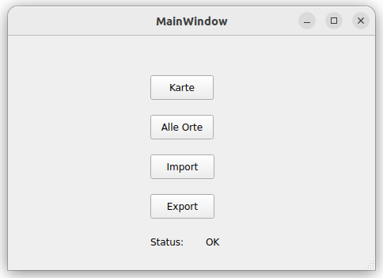
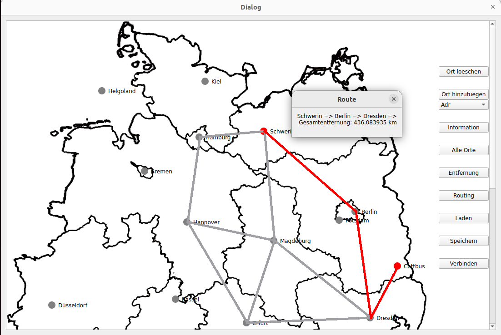

# Mini Navigationssystem
[](./README.md)
[](./README.md)

## Überblick
Das "Mini Navigationssystem" ist eine benutzerfreundliche GUI-Anwendung, die in C++ entwickelt wurde, und dient, um die beste Route innerhalb Deutschland herauszufinden. 

Mit einer intuitiven und einfachen Benutzeroberfläche können Benutzer benutzerdefinierte Orte hinzuzufügen, bereits importierte Städte verwenden, Verbindungen zwischen ihnen herstellen und dynamisch Routen für die Navigation generieren.

### Screenshots




## Erste Schritte
Diese Anleitung hilft dir, eine Kopie des Projekts auf deinem lokalen Rechner einzurichten und für Entwicklungs- und Testzwecke zu nutzen.


### Voraussetzungen
* Qt (Version 5.15.3 oder höher)
* C++ Compiler (wie g++ oder MSVC)
* QMake (Version 3.1, üblicherweise im Qt-Paket enthalten)


### Installation
1. Klone das Repository auf deinem lokalen Rechner:
```
git clone https://github.com/deinbenutzername/projekt-name.git
```
2. Wechsle in das Projektverzeichnis:
```
cd app
```
3. Führe QMake aus, um die Makefile zu generieren:
```
qmake Navi.pro
```
4. Baue das Projekt mit deinem Compiler:
```
make
```


### Build
1. Navigiere zum Build-Verzeichnis:
```
cd build
```
2. Starte die ausführbare Datei:
```
./Navi
```

## Kontakt
Dinh The Huy

Projekt Link: https://github.com/dinhthehuy/Navigationssystem
