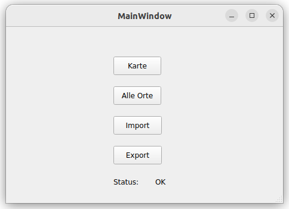

# Mini Navigationssystem
[](./README.md)
[](./README.de.md)

## Overview
"Mini Navigationssystem" is a user-friendly GUI application developed in C++, designed to find the best route within Germany.

With an intuitive and simple user interface, users can add custom locations, use already imported cities, establish connections between them, and dynamically generate routes for navigation."

### Screenshots



## Getting Started
This guide helps you set up a copy of the project on your local machine and use it for development and testing purposes.


### Prerequsites
* Qt (Version 5.15.3 or higher)
* C++ Compiler (g++)
* QMake (Version 3.1 or higher)


### Installation
1. Clone the repository to your local machine:
```
git clone https://github.com/deinbenutzername/projekt-name.git
```
2. Navigate to the project directory:
```
cd app
```
3. Execute QMake to generate Makefile:
```
qmake Navi.pro
```
4. Build the project with your Compiler:
```
make
```


### Build
1. Navigate to Build directory:
```
cd build
```
2. Run the executable file:
```
./Navi
```

## Contact
Dinh The Huy
Project's link: https://github.com/dinhthehuy/Navigationssystem
